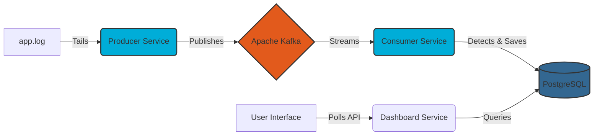
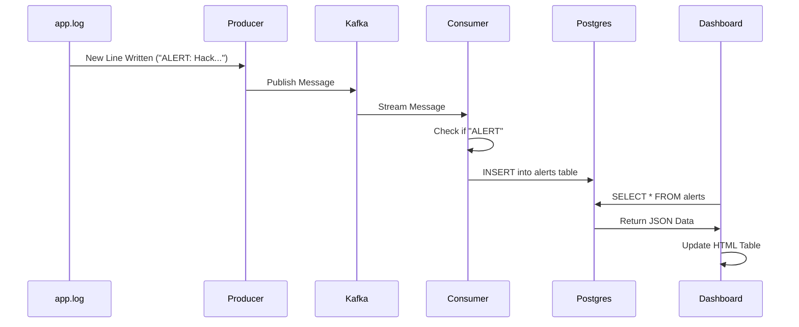

# Log Sentinel

Log Sentinel is a distributed, event-driven security monitoring system designed to simulate a Security Operations Center (SOC) architecture.

The system utilizes a decoupled microservices pattern to ingest application logs in real-time, transport them via a distributed message broker, analyze them for security threats, and visualize actionable intelligence on a live dashboard.

## System Architecture

The following diagram illustrates the high-level infrastructure and data flow:



## How It Works (Data Flow)

The project implements a full data engineering pipeline:

1. **Ingestion Layer (Producer Service):** A Go service that watches log files in real-time (similar to `tail -f`). It captures log streams and publishes them to the Kafka cluster. It also simulates traffic by injecting random "Failed Login" security events.
2. **Transport Layer (Apache Kafka):** A high-throughput distributed messaging system running in KRaft mode (ZooKeeper-less). It acts as the central buffer, ensuring data persistence and decoupling the producer from consumers.
3. **Processing Layer (Consumer Service):** A Go service that subscribes to the Kafka stream. It filters noise from the logs, identifies specific security threats (e.g., "ALERT" tags), and writes these incidents to persistent storage.
4. **Storage Layer (PostgreSQL):** A relational database running in Docker. It serves as the "Vault," storing a permanent history of all detected security incidents for audit and analysis.
5. **Visualization Layer (SOC Dashboard):** A full-stack web application (Go Backend + HTML/JS Frontend) that polls the database and renders a live, auto-updating table of security threats.

## Technology Stack

* **Core Language:** Go (Golang) 1.21+
* **Message Broker:** Apache Kafka (Confluent Platform, KRaft mode)
* **Database:** PostgreSQL 15 (Alpine)
* **Infrastructure:** Docker & Docker Compose
* **Frontend:** Vanilla JavaScript & HTML (Polling Architecture)
* **Key Libraries:**
* `segmentio/kafka-go`: High-performance Kafka client.
* `lib/pq`: Pure Go Postgres driver.
* `nxadm/tail`: Real-time file system monitoring.


## Project Structure

```text
log-sentinel/
├── cmd/
│   ├── producer/
│   │   └── main.go       # Service 1: Log Watcher & Forwarder
│   ├── consumer/
│   │   └── main.go       # Service 2: Log Analyzer & DB Writer
│   └── dashboard/
│       ├── main.go       # Service 3: Web Server & API
│       └── templates/
│           └── index.html # The SOC Frontend
├── docker-compose.yml    # Infrastructure Configuration (Kafka + Postgres + UI)
├── go.mod                # Dependency Definitions
└── README.md             # Project Documentation

```

## Prerequisites

* **Go:** Version 1.21 or higher.
* **Docker Desktop:** Installed and running.
* **Git:** Version control.

## Installation & Usage

### 1. Start the Infrastructure

Use Docker Compose to spin up the Kafka Cluster, PostgreSQL Database, and Kafka UI.

```bash
docker-compose up -d

```

Verify that all three containers (`kafka`, `postgres`, `kafka-ui`) are running:

```bash
docker ps

```

### 2. Start the Services

You will need to run the three microservices in separate terminal windows to simulate the distributed environment.

**Terminal 1: The Producer (Spy)**
Generates traffic and sends logs to Kafka.

```bash
go run cmd/producer/main.go

```

**Terminal 2: The Consumer (Analyst)**
Reads from Kafka, detects threats, and saves them to the database.

```bash
go run cmd/consumer/main.go

```

**Terminal 3: The Dashboard (SOC)**
Starts the web server to visualize the data.

```bash
go run cmd/dashboard/main.go

```

### 3. Access the Interfaces

* **SOC Dashboard:** Open `http://localhost:8081` in your browser. You will see a live table of threats updating every 2 seconds.
* **Kafka Control Center:** Open `http://localhost:8080` to inspect topics, partitions, and raw message flow.
* **Database:** You can connect directly to the Postgres instance using any SQL client:
* **Host:** localhost
* **Port:** 5432
* **User:** admin
* **Password:** secretpassword
* **Database:** logsentinel


## Sequence of Events

The following sequence diagram explains the lifecycle of a "Hack Attempt" in the system:



## Features

* **Real-time Log Tailing:** Detects file changes instantly.
* **Fault Tolerance:** If the Consumer crashes, Kafka retains the logs. When the Consumer restarts, it processes missed messages automatically.
* **Threat Simulation:** The Producer randomly injects mock "Hacking Attempts" to test detection logic.
* **Persistent Storage:** Alerts are saved to PostgreSQL via Docker Volumes, persisting even if containers are restarted.
* **Live Monitoring:** The custom dashboard provides a near real-time view of the security posture.
